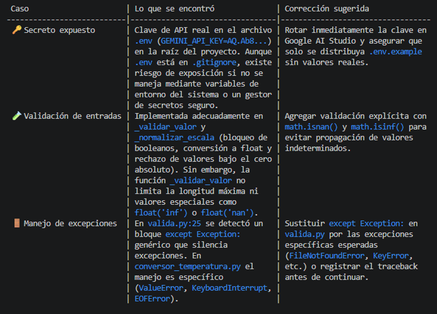
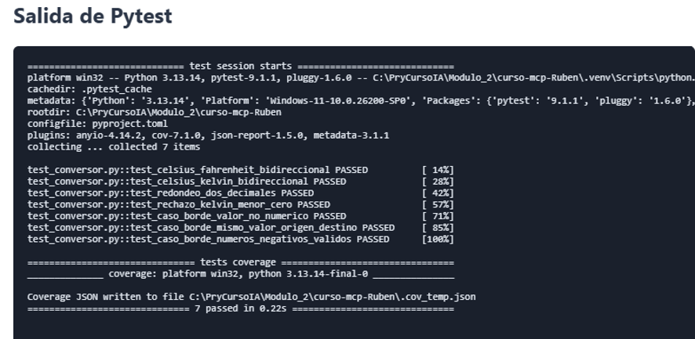

## Resultados
### Respuestas a las preguntas
1.	¿En qué se sintió distinto invocar "agentes" comparado con invocar "skills" sueltas?

Invocar una skill suelta ejecuta una capacidad específica. En cambio, invocar un agente implica un rol completo: tiene una responsabilidad, herramientas permitidas, instrucciones y un formato de salida definido.

Por ejemplo, tester-agent combina qa-unit, qa-integration y qa-coverage, mientras que security-agent solo utiliza qa-security.

2.	¿Qué pasaría si el security-agent intentara modificar tus tests? ¿Podría, con la configuración que armaron?

Con la configuración actual, no debería poder hacerlo:

Solo tiene asignada la skill qa-security.
Su responsabilidad exclusiva es detectar riesgos.
Las instrucciones indican que no debe ocuparse de los tests.
La modificación de tests pertenece al tester-agent.

Aun así, esta restricción depende de que el sistema respete la lista de herramientas asignadas. Las instrucciones del archivo son una regla de comportamiento, no una barrera de seguridad absoluta del sistema operativo. Para garantizarlo completamente habría que aplicar permisos reales de archivos o herramientas.

3.	Tú fuiste el orquestador hoy — invocando a cada agente en el momento correcto. ¿Cómo sería si otro agente (no ustedes) decidiera ese orden?

Ese agente actuaría como orquestador. Tendría que decidir qué agente ejecutar, en qué momento y con qué resultados previos. En este proyecto el orden definido es:

tester-agent: tests y cobertura.
security-agent: revisión de seguridad.
report-agent: consolidación final.
El orden importa porque report-agent depende de los resultados de los dos anteriores. Si otro agente cambiara el orden, podría generar un reporte incompleto, ejecutar el análisis de seguridad antes de disponer de los resultados funcionales o detener el flujo si falta test-spec.md.

